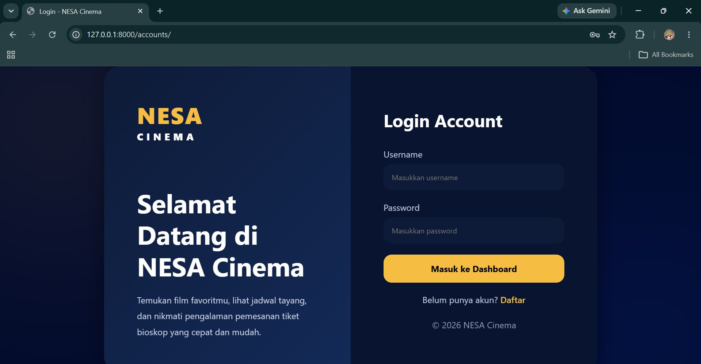
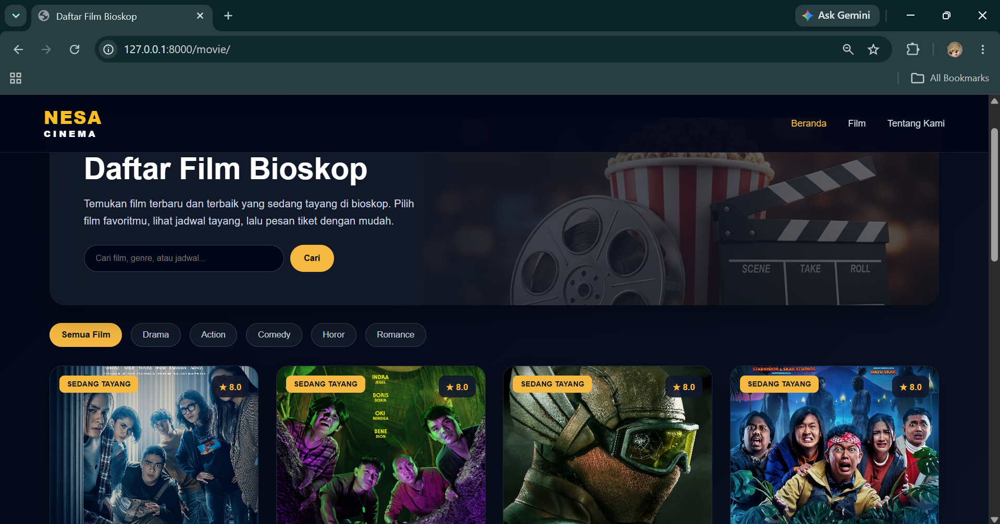
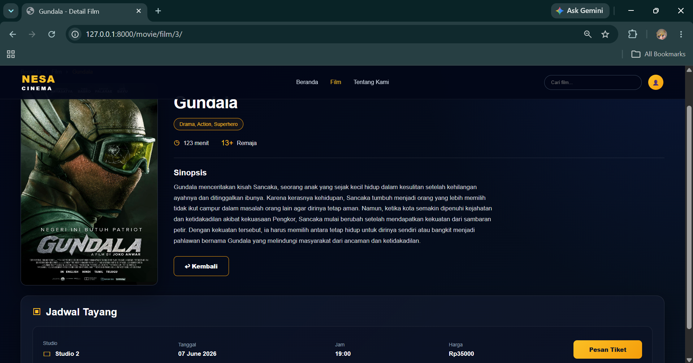
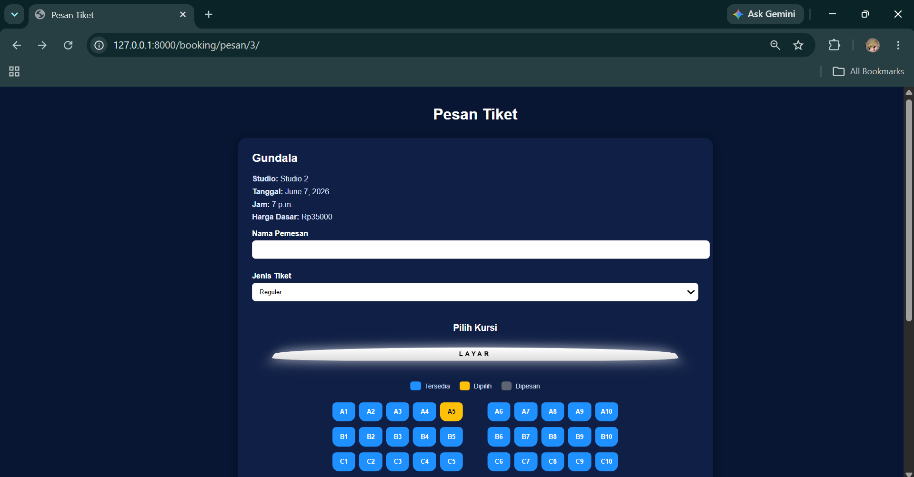
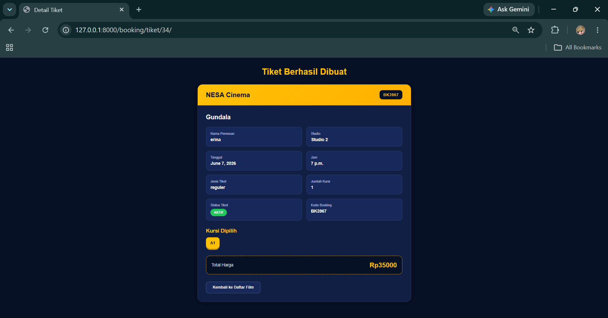
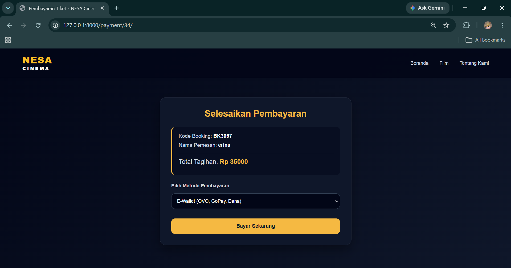

# NESA Cinema

## Deskripsi Project

**NESA Cinema** adalah aplikasi web pemesanan tiket bioskop berbasis Django. Aplikasi ini dibuat untuk memudahkan pengguna dalam melihat daftar film, melihat detail film dan jadwal tayang, memilih kursi, melakukan pemesanan tiket, serta melanjutkan proses pembayaran.

Project ini juga dibuat sebagai tugas kelompok dengan menerapkan konsep **Object Oriented Programming (OOP)**, yaitu **Inheritance, Abstraction, Polymorphism, dan Encapsulation**.

## Anggota Kelompok

1. Fath Rastra Sewa Kottama (25051204060) 
2. Ezar Valeno Oktafalah (25051204062) 
3. Muhammad Rafli (25051204125) 
4. M. Ragil Surya Saputra (25051204127) 

## Fitur Utama

### 1. Login User

Pengguna harus login terlebih dahulu sebelum masuk ke halaman utama website. Setelah login berhasil, pengguna akan diarahkan ke halaman daftar film.

### 2. Daftar Film

Menampilkan daftar film yang sedang tayang di bioskop. Setiap film memiliki informasi seperti judul, genre, durasi, sinopsis, dan poster film.

### 3. Detail Film dan Jadwal Tayang

Pengguna dapat melihat detail film dan jadwal tayang berdasarkan film yang dipilih. Jadwal tayang berisi informasi studio, tanggal, jam tayang, dan harga dasar tiket.

### 4. Pemesanan Tiket

Pengguna dapat melakukan pemesanan tiket berdasarkan jadwal film yang dipilih. Pada fitur ini pengguna mengisi nama pemesan, memilih jenis tiket, dan memilih kursi.

### 5. Pemilihan Kursi

Pengguna dapat memilih kursi yang tersedia. Kursi yang sudah dipesan akan berubah status sehingga tidak dapat dipilih kembali oleh pengguna lain.

### 6. Detail Tiket

Setelah pemesanan berhasil, sistem akan menampilkan detail tiket yang berisi kode booking, nama pemesan, film, studio, tanggal, jam, jenis tiket, jumlah kursi, total harga, status tiket, dan kursi yang dipilih.

### 7. Payment

Setelah tiket berhasil dibuat, pengguna dapat melanjutkan ke menu pembayaran. Bagian payment digunakan untuk proses pembayaran tiket yang sudah dipesan.

## Cara Menjalankan Project

### 1. Clone Repository

```bash
git clone https://github.com/mhmdraflyyy/nesa-cinema.git
```

### 2. Masuk ke Folder Project

```bash
cd nesa-cinema
```

### 3. Buat Virtual Environment

```bash
python -m venv Env
```

### 4. Aktifkan Virtual Environment

Untuk Windows:

```bash
Env\Scripts\activate
```

### 5. Install Library

```bash
pip install -r requirements.txt
```

### 6. Jalankan Migrasi Database

```bash
python manage.py makemigrations
python manage.py migrate
```

### 7. Buat Superuser

```bash
python manage.py createsuperuser
```

### 8. Jalankan Server

```bash
python manage.py runserver
```

### 9. Buka Website

```bash
http://127.0.0.1:8000/
```

## Alur Penggunaan Aplikasi

1. Pengguna membuka website.
2. Pengguna diarahkan ke halaman login.
3. Setelah login berhasil, pengguna masuk ke halaman daftar film.
4. Pengguna memilih film.
5. Pengguna melihat detail film dan jadwal tayang.
6. Pengguna memilih jadwal dan melakukan booking tiket.
7. Pengguna memilih kursi yang tersedia.
8. Pengguna dapat melanjutkan ke menu payment.
9. Sistem menampilkan detail tiket.

## Penjelasan Implementasi OOP

### 1. Inheritance

Inheritance diterapkan ketika class turunan mewarisi atribut atau method dari class induk.

Contoh penerapan pada project ini terdapat pada class harga tiket. Class `HargaReguler`, `HargaPelajar`, dan `HargaWeekend` mewarisi class dasar `HargaTiket`.

```python
class HargaReguler(HargaTiket):
    def hitung(self, jadwal, jumlah):
        return jadwal.harga_dasar * jumlah
```

Selain itu, model seperti `Film`, `Studio`, `JadwalTayang`, `Tiket`, dan `Kursi` juga mewarisi `models.Model` dari Django.

### 2. Abstraction

Abstraction diterapkan dengan membuat class dasar `HargaTiket` sebagai aturan umum perhitungan harga tiket. Class ini memiliki method abstrak `hitung()` yang wajib dibuat ulang oleh class turunannya.

```python
class HargaTiket(ABC):

    @abstractmethod
    def hitung(self, jadwal, jumlah):
        pass
```

Tujuannya adalah agar setiap jenis tiket memiliki aturan perhitungan harga sendiri, tetapi tetap mengikuti struktur method yang sama.

### 3. Polymorphism

Polymorphism diterapkan pada method `hitung()` yang memiliki nama sama, tetapi isi perhitungannya berbeda pada setiap class.

Contohnya:

```python
class HargaReguler(HargaTiket):
    def hitung(self, jadwal, jumlah):
        return jadwal.harga_dasar * jumlah


class HargaPelajar(HargaTiket):
    def hitung(self, jadwal, jumlah):
        diskon = 0.2
        harga_setelah_diskon = jadwal.harga_dasar - (jadwal.harga_dasar * diskon)
        return int(harga_setelah_diskon * jumlah)


class HargaWeekend(HargaTiket):
    def hitung(self, jadwal, jumlah):
        tambahan = 10000
        return (jadwal.harga_dasar + tambahan) * jumlah
```

Meskipun method yang dipanggil sama, yaitu `hitung()`, hasil perhitungannya bisa berbeda tergantung jenis tiket yang dipilih.

### 4. Encapsulation

Encapsulation diterapkan dengan membatasi proses perubahan data agar tidak dilakukan langsung dari template. Perubahan data penting dilakukan melalui method pada model atau service.

Contohnya pada model `Kursi`, status kursi diubah melalui method `pilih_kursi()`.

```python
def pilih_kursi(self):
    self.status = 'DIPESAN'
    self.save()
```

Dengan cara ini, user tidak mengubah status kursi secara langsung. Sistem yang mengatur perubahan status kursi setelah proses booking berhasil.

Encapsulation juga diterapkan pada proses pembuatan tiket melalui `TiketService`. Service ini bertugas melakukan validasi, menghitung total harga, menyimpan tiket, dan mengubah status kursi.

## Screenshot Tampilan Program

### 1. Halaman Login

Tambahkan screenshot halaman login di bagian ini





### 2. Halaman Daftar Film

Tambahkan screenshot halaman daftar film di bagian ini.





### 3. Halaman Detail Film

Tambahkan screenshot halaman detail film di bagian ini.





### 4. Halaman Booking Tiket

Tambahkan screenshot halaman booking tiket di bagian ini.





### 5. Halaman Detail Tiket

Tambahkan screenshot halaman detail tiket di bagian ini.





### 6. Halaman Payment

Tambahkan screenshot halaman payment di bagian ini.





## Tolls yang Digunakan

* Python
* Django
* HTML
* CSS
* SQLite
* GitHub

## Kesimpulan

NESA Cinema merupakan aplikasi web pemesanan tiket bioskop yang dibuat menggunakan Django. Aplikasi ini memiliki fitur utama berupa login user, daftar film, detail film, jadwal tayang, booking tiket, pemilihan kursi, detail tiket, dan payment. Project ini juga menerapkan konsep OOP seperti inheritance, abstraction, polymorphism, dan encapsulation.
